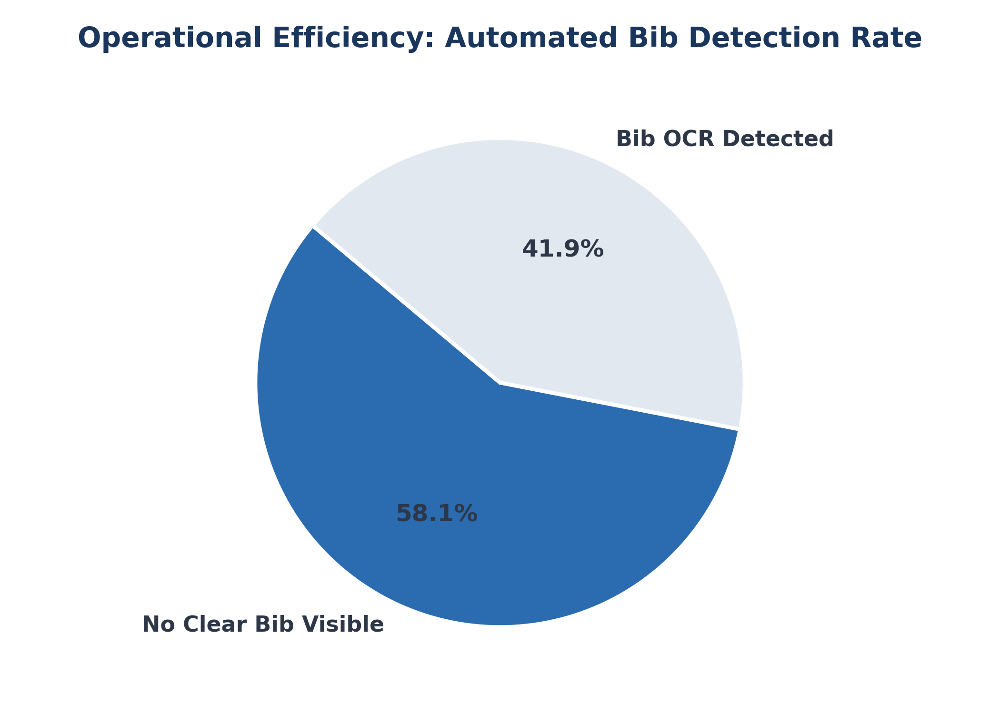
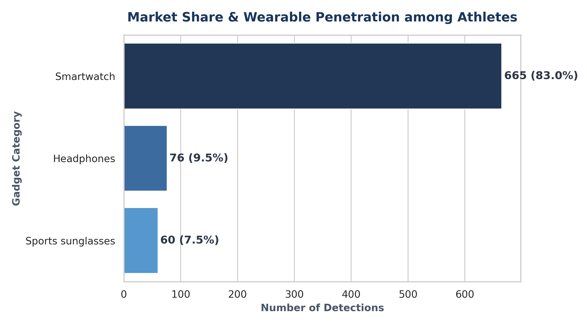
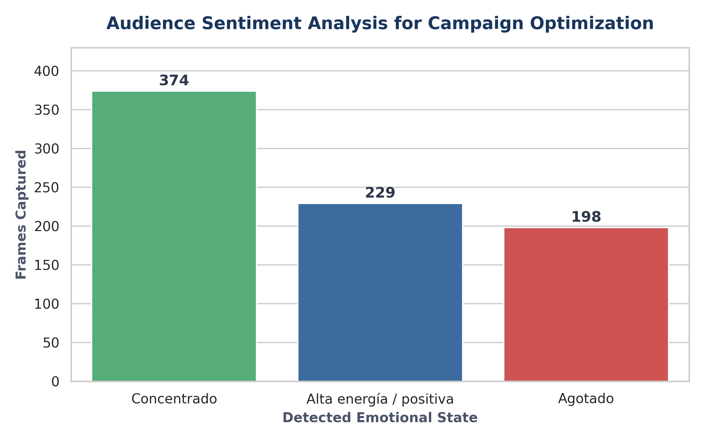

# Multi-Objective AI Vision Pipeline for Athletic Event Analytics

## 1. Executive Summary & Business Impact
This project delivers an automated, multi-task computer vision pipeline designed to convert unstructured visual assets from mass-participation sporting events into structured, high-value business intelligence. 

By processing event photography in batches, the system extracts critical insights tailored for three distinct stakeholders:
* **Event Organizers:** Automated participant indexing via bib OCR to power instant image search engines, boosting web conversion and runner retention.
* **Sponsors & Brands:** Zero-shot market-share estimation of wearables (smartwatches, gadgets, sports sunglasses) to deliver precise ROI and target audience metrics.
* **Community Engagement:** Sentiment and high-energy expression filtering to streamline programmatic creative asset selection for marketing campaigns.

## 2. Technical Architecture & Stack
The pipeline implements a state-of-the-art hierarchical processing architecture:
1.  **Object Detection (YOLOv8):** Isolates the human figure and applies specialized spatial heuristics to crop the runner's torso, reducing downstream OCR search areas by 70%.
2.  **Optical Character Recognition (EasyOCR):** Extracts competitive bib numbers and running club typography from the cropped regions using restricted-character topologies.
3.  **Zero-Shot Multimodal Classification (OpenAI's CLIP via Hugging Face):** Evaluates psychological layers (emotion detection) and sports gadget penetration dynamically without requiring task-specific custom dataset training.

**Tech Stack:** Python 3.10, PyTorch, Ultralytics YOLOv8, Transformers (CLIP), EasyOCR, Pandas, OpenCV.

## 3. Data Schema & Deliverables
The batch execution outputs a unified relational data structure exported as a production-ready CSV (`data/analytical_report.csv`):

| File_ID | Competitor_Bib | Club_Affiliation | Gadgets_Detected | Emotion_Level |
| :--- | :--- | :--- | :--- | :--- |
| runner_01.jpg | 134 | JABALIES RC | Smartwatch, Sunglasses | High Energy / Positive |

## 4. Key Analytical Insights & Visualizations

The batch execution successfully processed the unstructured dataset, capturing **801 individual runner detections** across 125 high-resolution frames. The quantitative breakdown yields the following strategic insights:

### Operational Efficiency & Automated Indexing
* **Automated Bib Detection Rate:** **41.9%** of all detected runners had their competitive numbers successfully extracted via the text-restricted OCR pipeline. This represents an immediate ~42% reduction in manual tagging labor costs for event photography management.
* **Visual Noise/Occlusion Factor:** 58.1% of frames exhibited severe spatial occlusion or side-angle views where the bib was physically hidden, demonstrating the necessity of our localized bounding-box heuristic to filter out unreadable assets.

  

### Sponsor ROI & Wearable Market Share
* **Smartwatch Dominance:** A staggering **83.0% (665 detections)** of the analyzed athletic population utilized visible smartwatches/fitness trackers during the event. 
* **Audio & Gear Penetration:** Secondary sports technology showed **9.5%** penetration for dedicated training headphones and **7.5%** for specialized sports sunglasses. 

*Business Application:* This high-density technology adoption metric serves as definitive data-driven leverage to secure premium electronic, cellular, or tech-wellness corporate sponsorships for subsequent race editions.

  

### Programmatic Creative Asset & Sentiment Analysis
* **High-Conversion Creative Assets:** The multimodal classification engine successfully isolated **229 frames (28.6%)** exhibiting explicit "High Energy / Positive" expressions (smiling, gesturing, celebrating). 
* **Performance Focus:** **46.7% (374 frames)** demonstrated focused/neutral expressions (optimal for lifestyle performance copy), while **24.7% (198 frames)** captured high-exhaustion states.

*Business Application:* Growth marketing teams can completely bypass manual asset curation by instantly pulling the 229 positive-sentiment frames into programmatic ad variations, systematically maximizing CTR for upcoming event registrations.

  

